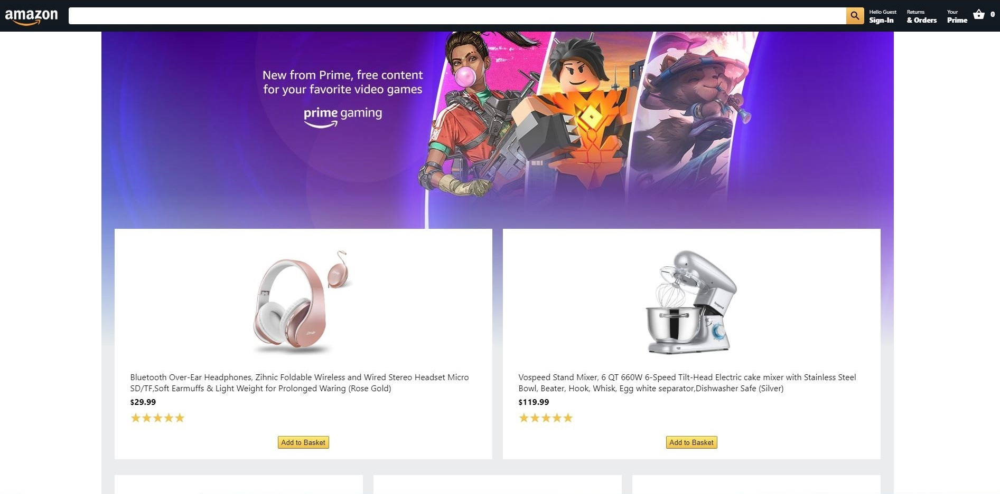

# Amazon Clone

Amazon clone with full login and e-commerce functionality built in React JS.
This app uses Stripe functionality and Firebase for user authentication and hosting.

Live Demo: [Amazon Clone](https://clone-eb991.web.app/)

## Getting Started

After downloading, in the project directory, you can run:

### `npm start`

Runs the app in the development mode. 
Open [http://localhost:3000](http://localhost:3000) to view it in the browser.

When checking out, you can use this card for testing:

> CCN: 4242 4242 4242 4242 

> Date: 04/24 

> CVV: 242 

> Zip: 42424

## Built With

This project was bootstrapped with [Create React App](https://github.com/facebook/create-react-app).

* [React JS](https://reactjs.org/)
* [Firebase](https://firebase.google.com/)
* [Stripe](https://stripe.com/)