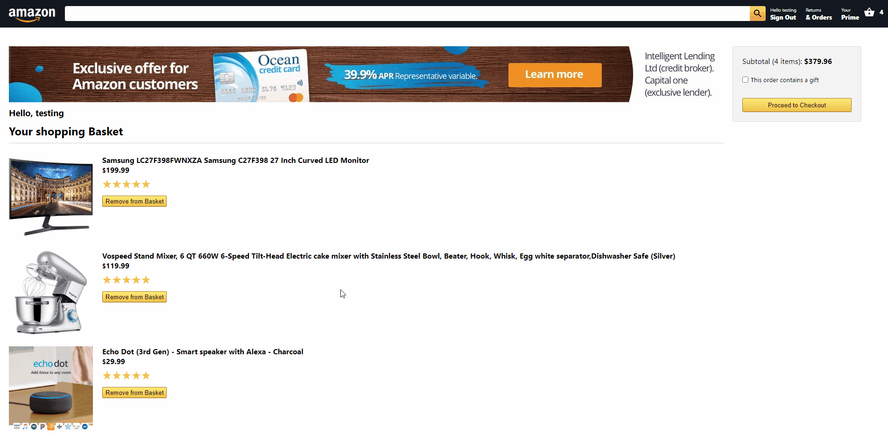
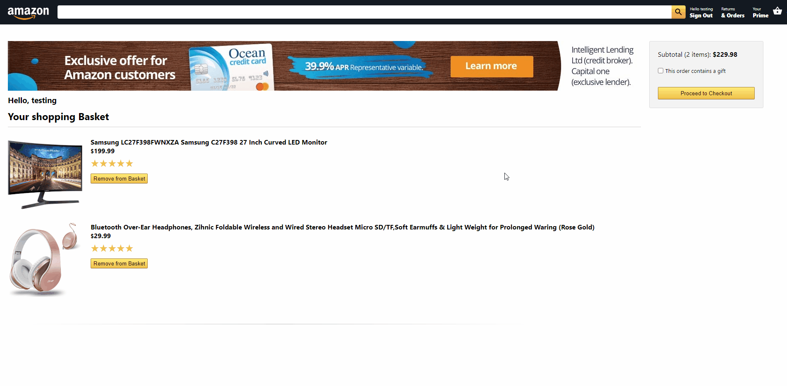

# Amazon Clone

This is an Amazon clone built with React. It has full login and e-commerce functionality. The clone allows users to register, login, and get their order history as well as add and remove items from their shopping cart, and payment processing.

This app uses Stripe for payment processing and Firebase for user authentication and hosting.

Checkout the [Live Demo](https://clone-eb991.web.app/)

## Getting Started

You do not need to make an account to purchase an item. However, the order will not be saved and will not be displayed in the Orders page even after you log in.

### Demo Account

You can use this account for demo:

> Email: testing@gmail.com

> Password: abc123

On the checkout page, you can see the current items in the basket and the subtotal of all the items. Items can be removed from the basket at checkout or during payment processing by clicking on the "Remove from Basket" button. The item will be removed and the subtotal updated.

When checking out, use this card for testing:

> CCN: 4242 4242 4242 4242 

> Date: 04/24 

> CVV: 242 

> Zip: 42424

### Installation
Before you download the project, make sure to have node.js installed. You can find it [here.](https://nodejs.org/en/download/)

After downloading, navigate to the project directory and run:

`npm install`

Start the server by running:

`npm build`

`npm start`

Open [http://localhost:3000](http://localhost:3000) to view it in the browser.

## Built With

This project was bootstrapped with [Create React App](https://github.com/facebook/create-react-app).

* [React JS](https://reactjs.org/)
* [Firebase](https://firebase.google.com/)
* [Stripe](https://stripe.com/)
* [Material-UI](https://material-ui.com/)